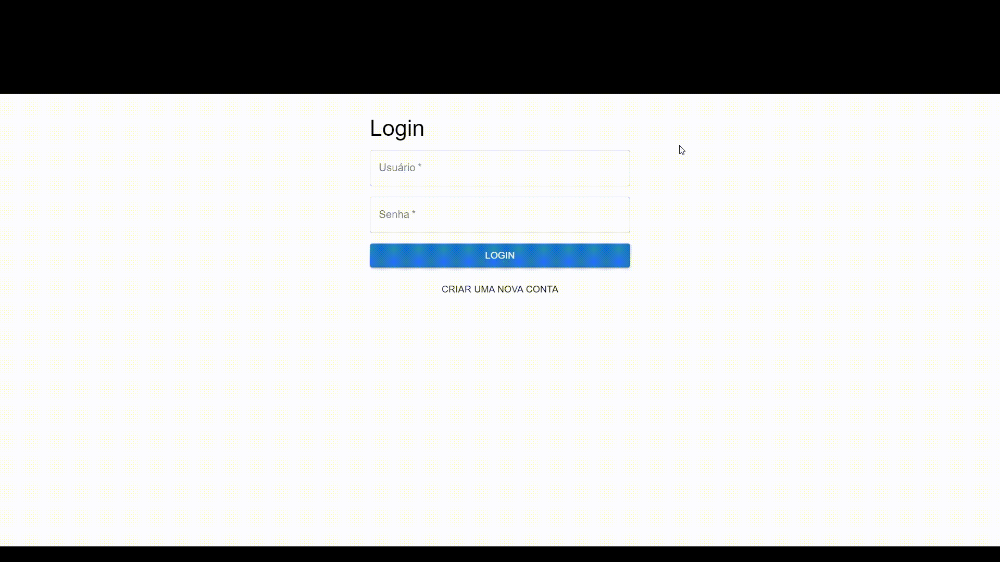

# To-Do List Frontend - Vite + React

Este projeto é a interface de usuário para o gerenciamento de tarefas (**To-Do List**) desenvolvido com **Vite** e **ReactJS**. Ele se conecta a uma API de back-end que gerencia as tarefas, permitindo aos usuários criar, listar, atualizar e excluir tarefas. A aplicação também inclui autenticação via **JWT** para proteger as rotas.

## Funcionalidades

- **Autenticação de Usuário**:
  - Login de usuários com nome de usuário e senha.
  - Registro de novos usuários.
  - Logout e gerenciamento de sessões utilizando JWT.

- **Gerenciamento de Tarefas**:
  - Adicionar novas tarefas com título e descrição.
  - Atualizar o status de tarefas (de pendente para completa e vice-versa).
  - Excluir tarefas.
  - Listar todas as tarefas de um usuário autenticado.

- **Feedback Visual e Interatividade**:
  - A interface oferece feedback visual para a criação, atualização e remoção de tarefas.
  - Uso de **Material UI** para estilização de componentes e elementos interativos.
  - Animações com **Framer Motion** para uma experiência de usuário mais suave.

## Tecnologias Utilizadas

### Frontend
- **ReactJS**: Biblioteca JavaScript para construção de interfaces de usuário.
- **Vite**: Ferramenta rápida de build para desenvolvimento de front-end com React.
- **JavaScript (ES6+)**: Linguagem de programação principal usada para toda a lógica do front-end.
- **Material UI (MUI)**: Biblioteca de componentes React para estilização e design moderno.
- **Framer Motion**: Biblioteca de animações para React, utilizada para melhorar a interatividade e a experiência do usuário.
  
### Ferramentas e Integração
- **Axios ou Fetch API**: Para fazer requisições HTTP à API de back-end.
- **LocalStorage**: Armazenamento local do token JWT para autenticação.
- **Vercel**: Utilizado para fazer o deploy do front-end, tornando-o acessível publicamente.

## Vídeo Demonstrativo



---

## Como Executar Localmente

### Pré-requisitos

- **Node.js** e **npm** instalados na máquina.

### Passos para execução

1. Clone o repositório:
   ```bash
   git clone https://github.com/seu-usuario/seu-repositorio-frontend.git
   cd seu-repositorio-frontend
   ```

2. Instale as dependências:
   ```bash
   npm install
   ```

3. Crie um arquivo `.env` com a variável de ambiente para a URL da API (back-end):
   ```
   VITE_API_URL=https://seu-backend-url.com
   ```

4. Inicie o servidor de desenvolvimento:
   ```bash
   npm run dev
   ```

5. Acesse a aplicação em `http://localhost:3000`.

## Deploy

Este projeto foi implantado utilizando a **Vercel**, e está disponível publicamente. O deploy contínuo está configurado, de modo que toda alteração no código no GitHub dispara um novo build e deploy automaticamente.

## Configuração de Variáveis de Ambiente na Vercel

Antes de fazer o deploy na Vercel, certifique-se de adicionar as seguintes variáveis de ambiente:

- `VITE_API_URL`: URL da API do back-end (ex.: https://seu-backend-url.com)

Para adicionar variáveis de ambiente:
1. Acesse o painel da Vercel.
2. Navegue até o projeto.
3. Vá para **Settings** > **Environment Variables** e adicione a variável `VITE_API_URL`.

## Estrutura do Projeto

```
src/
│
├── components/        # Componentes React como Login, TaskForm, TaskList
├── api.js             # Módulo para interações com a API (fetch de tarefas, login, etc.)
├── App.jsx            # Componente principal que gerencia o estado global
├── main.jsx           # Arquivo de entrada principal
├── styles/            # Arquivos de estilização (CSS)
└── ...
```

### Componentes Principais

- **Login**: Permite ao usuário fazer login com nome de usuário e senha.
- **Cadastro**: Permite registrar novos usuários.
- **TaskList**: Exibe a lista de tarefas do usuário autenticado, permitindo a atualização do status e exclusão de tarefas.
- **TaskForm**: Formulário para adicionar novas tarefas.

## Melhorias Futuras

- **Paginação**: Implementar paginação para melhorar a performance na listagem de muitas tarefas.
- **Validação mais avançada**: Melhorar as mensagens de erro e validações de campos.
- **Upload de Imagens**: Adicionar funcionalidade para o upload de imagens nas tarefas.

---